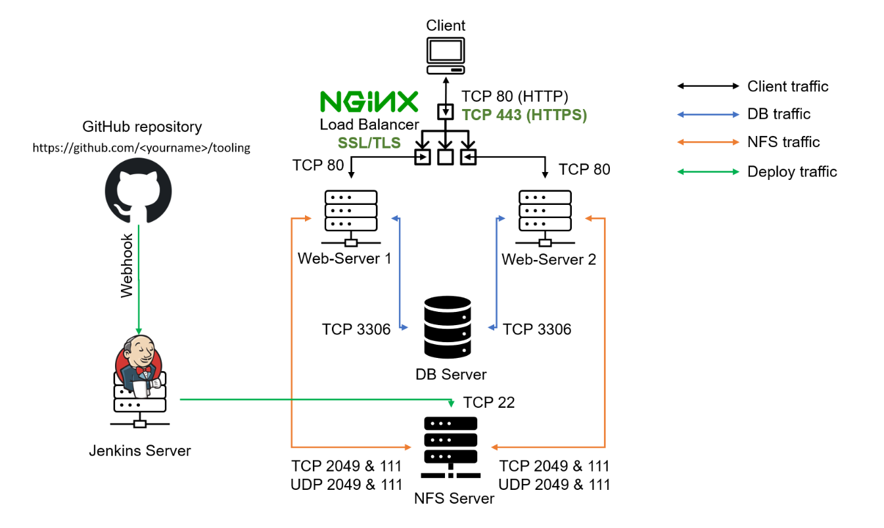

# LOAD-BALANCER-SOLUTION-WITH-NGINX-AND-SSL-TLS

## ***Task*** ##
## This project consists of two parts: ##

1. Configure Nginx as a Load Balancer
2. Register a new domain name and configure secured connection using SSL/TLS certificates

The target architecture will look like this:

