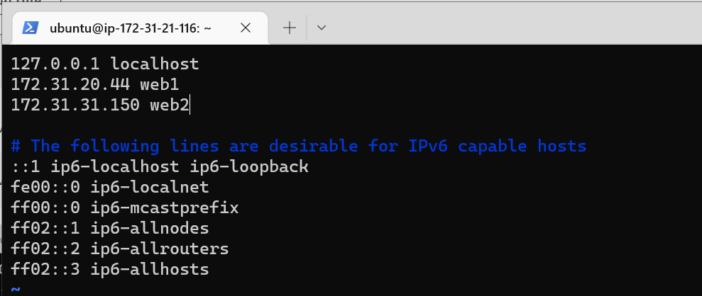
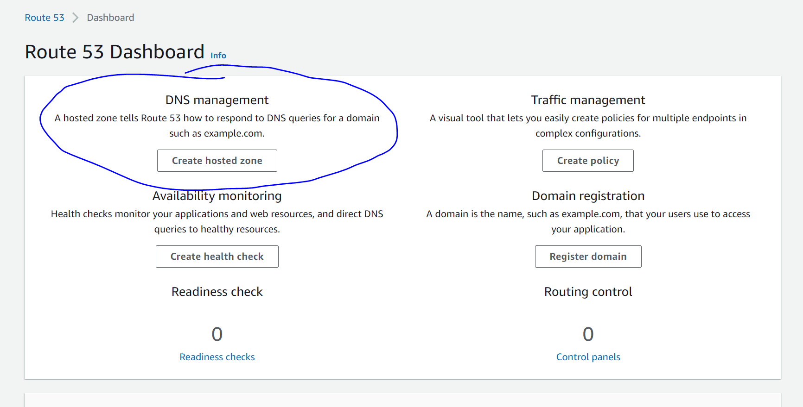

## ***CONFIGURE NGINX AS A LOAD BALANCER*** ##

Create an EC2 VM based on Ubuntu Server 20.04 LTS and name it Nginx LB 


Open TCP port 80 for HTTP connections and also, open TCP 443 for secured HTTPS connections


Update /etc/hosts file for local DNS with Web Servers’ names (e.g. Web1 and Web2) and their local IP addresses


Install and configure Nginx as a load balancer to point traffic to the resolvable DNS names of the webservers

Update the instance and Install Nginx

```
sudo apt update
sudo apt install nginx -y
```


Configure Nginx LB using Web Servers’ names defined in /etc/hosts

Open the default nginx configuration file
```
sudo vi /etc/nginx/nginx.conf
```
Insert the following configuration displayed on the screenshot into http section

taiwoakin.co.uk is my domain name registered in ionos and the Web1 and Web2 are the local DNS created in the /etc/hosts in the Nginx-LB


Restart Nginx and make sure the service is up and running
```
sudo systemctl restart nginx
sudo systemctl status nginx
```


### ***REGISTER A NEW DOMAIN NAME AND CONFIGURE SECURED CONNECTION USING SSL/TLS CERTIFICATES*** ###


Register a new domain name with any registrar of your choice in any domain zone.

taiwoakin.co.uk


Assign an Elastic IP to your Nginx LB server and associate your domain name with this Elastic IP


Update A record in taiwoakin.co.uk registrar to point to Nginx LB using Elastic IP address

To update the A record, search for route 53 on the top search bar 


Click on "Create hosted zone" under DBS management 


Eneter the domain name and make sure Public hosted zone is selected click create hosted zone.


Here is my hosted zone details showing the nameservers for my domain


I logged in to my domain provider, clicked on Domains & SSL, clicked on my domain name then clicked on Nameserver on the top


Copy and paste the nameservers in Route 53 hosted zones and paste them to your domain custom nameservers 


Create a A record for (taiwoakin.co.uk and www.taiwoakin.co.uk). In the Hosted zone details page, click on Create record. Make sure Record type is A and the Elastic IP as the Value and click create record.


Create another A record with www prefix and the eleastic ip as value


Check that your Web Servers can be reached from your browser using new domain name using HTTP protocol – taiwoakin.co.uk 


Install certbot and request for an SSL/TLS certificate

Make sure snapd service is active and running
```
sudo systemctl status snapd
```


Install certbot for SSL/TLS
```
sudo apt install certbot -y
```


Install a module required for certbot
```
sudo apt install python3-certbot-nginx -y
```


Request your certificate (just follow the certbot instructions – you will need to choose which domain you want your certificate to be issued for, domain name will be looked up from nginx.conf file so make sure you have updated it on

```
 sudo certbot --nginx -d taiwoakin.co.uk -d www.taiwoakin.co.uk
 ```


Test secured access to your Web Solution by trying to reach https://taiwoakin.co.uk 


Set up periodical renewal of your SSL/TLS certificate.
By default, LetsEncrypt certificate is valid for 90 days, so it is recommended to renew it at least every 60 days or more frequently.

You can test renewal command in dry-run mode
```
sudo certbot renew --dry-run
```


Best pracice is to have a scheduled job that to run renew command periodically. Let us configure a cronjob to run the command twice a day.

To do so, lets edit the crontab file with the following command:

```
crontab -e
```


Add following line:
```
* */12 * * *   root /usr/bin/certbot renew > /dev/null 2>&1
```


